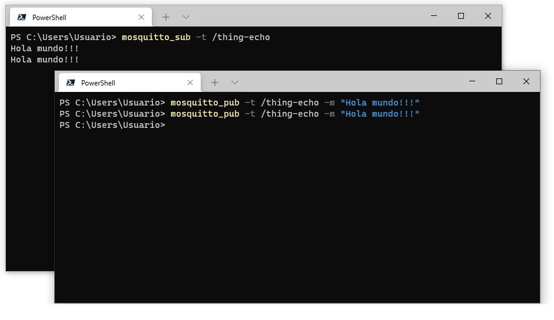
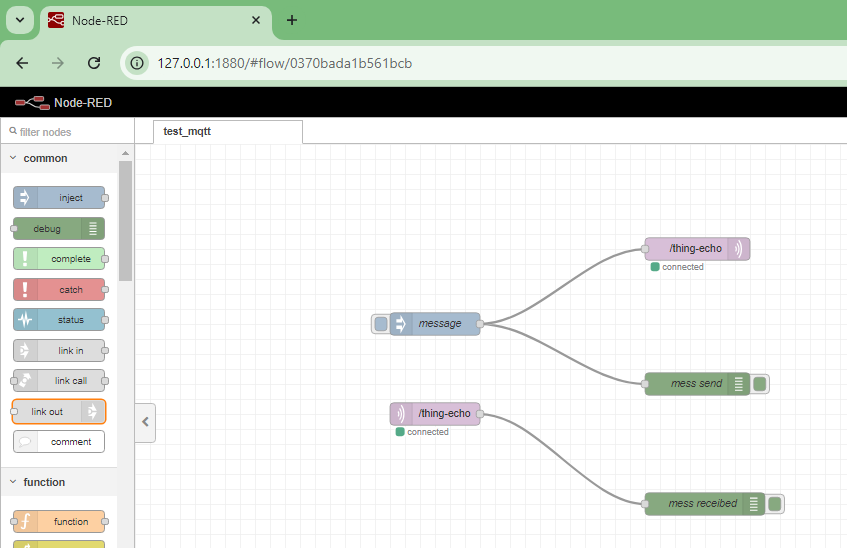
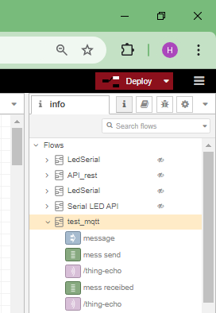
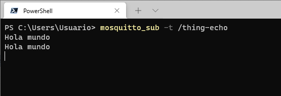
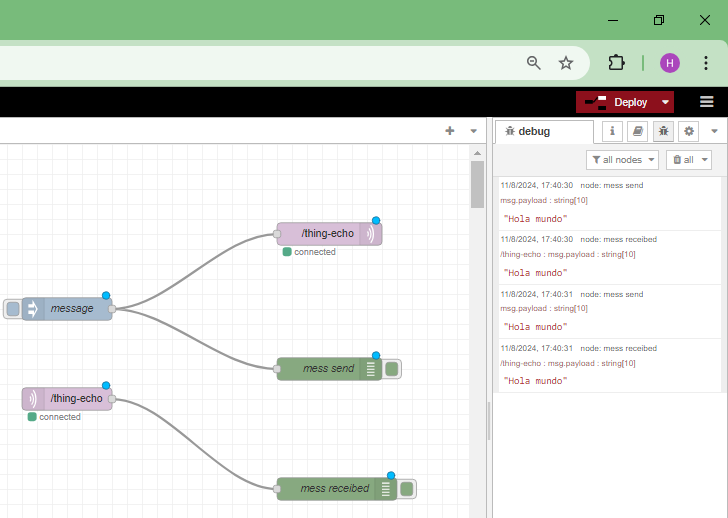

# Ensayo 1


## Test 1 - Inicial en mosquitto


```
mosquitto
```

```
mosquito_sub -t /thing-echo
```

```
mosquito_pub -t /thing-echo -m "Hola mundo!!!"
```

Ok

Los resultados se muestran a continuación:



## Test 2 - Conectar MQTT con Node-Red

Elementos

1. Inject
2. MQTT...
3. MQTT...
4. Debug...

* **Flujo**:
  
  

* **Resumen flujo**:
  
  

* **Debug flujo**: 
  
  Se enviaron dos mensajes de Hola mundo.

  Los resultados se muestran a continuación:

  

  

OK

## Test 3 - Aplicación que envia comandos para prender y apagar el bombillo en una oficina.


La siguiente tabla describe las cosas:


home/office/lamp

| **Escenario**                  | **Topico**                            | **JSON Message**                      |
|--------------------------------|--------------------------------------|---------------------------------------|
| Encender la lampara 1          | `house/lights/turn_on/1`             | `{ "command": "ON" }`                 |
| Apagar la lampara 1            | `house/lights/turn_on/1`             | `{ "command": "OFF" }`                |
| Estado de la lampara 1 (ON)    | `house/lights/state/1`               | `{ "state": "ON" }`                   |
| Estado de la lampara 1 (OFF)   | `house/lights/state/1`               | `{ "state": "OFF" }`                  |
| Encender la lampara 2          | `house/lights/turn_on/2`             | `{ "command": "ON" }`                 |
| Apagar la lampara 2            | `house/lights/turn_on/2`             | `{ "command": "OFF" }`                |
| Estado de la lampara 3 (ON)    | `house/lights/state/2`               | `{ "state": "ON" }`                   |
| Estado de la lampara 2 (OFF)   | `house/lights/state/2`               | `{ "state": "OFF" }`                  |
| Encender todas las luces (OFF) | `house/lights/turn_on/#`             | `{ "state": "ON" }`                   |
| Apagar todas las luces (ON)    | `house/lights/turn_on/#`             | `{ "state": "OFF" }`                  |
