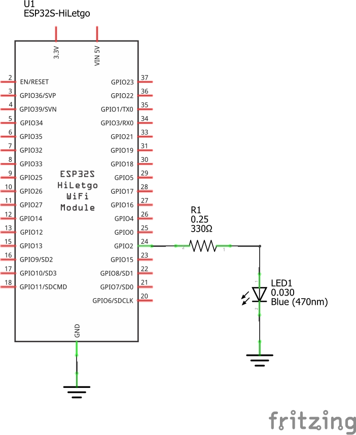
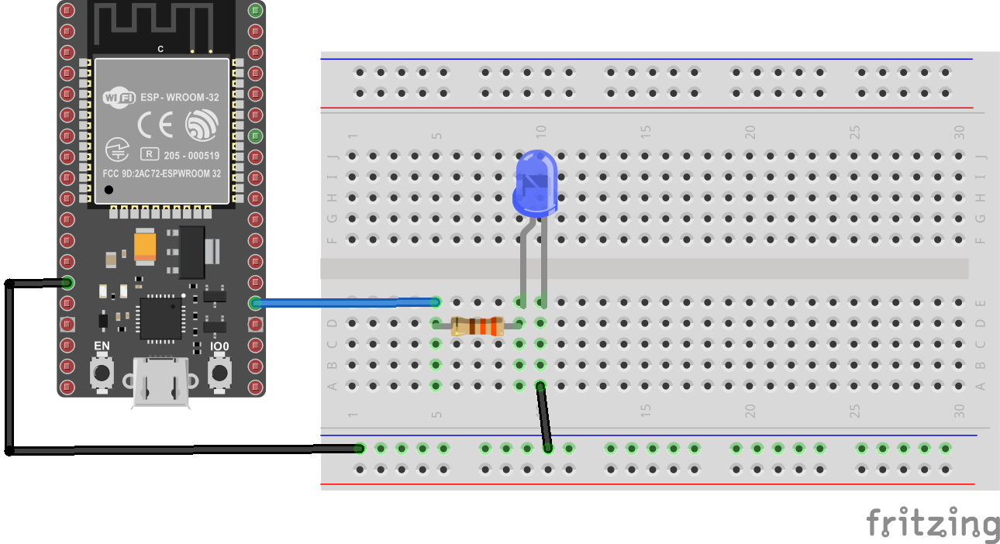

## Test 3 - Aplicación que envia comandos para prender y apagar el bombillo en una casa.


A continuación se describe el topic tree de la aplicación:

```
├── device
│   ├── id-dev1
│   │   ├── lights
│   │   │   ├── control
│   │   │   └── state
```

La siguiente tabla muestra los escenarios de la aplicación:

| **Escenario**                  | **Topico**                            | **JSON Message**                      |
|--------------------------------|---------------------------------------|---------------------------------------|
| Encender la lampara 1          | `house/device/id-dev1/lights/control` | `{ "command": "ON" }`                 |
| Apagar la lampara 1            | `house/device/id-dev1/lights/control` | `{ "command": "OFF" }`                |
| Estado de la lampara 1 (ON)    | `house/device/id-dev1/lights/state`   | `{ "state": "ON" }`                   |
| Estado de la lampara 1 (OFF)   | `house/device/id-dev1/lights/state`   | `{ "state": "OFF" }`                  |


### App

Informacion de la App

### Thing

Diagrama



Conexion



platformio.ini

```
[env:upesy_wroom]
platform = espressif32
board = upesy_wroom
framework = arduino
lib_deps = 
	knolleary/PubSubClient@^2.8
	bblanchon/ArduinoJson@^7.1.0
```

config.h

```h
#pragma once
#include <string>

using namespace std;

// ESP32 I/O config
#define LIGHT_PIN 2

// WiFi credentials
const char *SSID = "IoT";
const char *PASSWORD = "1245678h";

// MQTT settings
const string ID = "id-dev1";

const string BROKER = "192.168.43.55";

const string TOPIC = "house/device/" + ID;
const string STATUS_TOPIC = TOPIC + "/lights/state";  // P
const string CONTROL_TOPIC = TOPIC + "/lights/control"; // S
```

main.cpp

```c
#include <Arduino.h>
#include <WiFi.h>
#include <PubSubClient.h>
#include <ArduinoJson.h>
#include "config.h"

WiFiClient espClient;
PubSubClient client(espClient); // Setup MQTT client

// --- ESP32

void setup_ports() {
  pinMode(LIGHT_PIN, OUTPUT); // Configure LIGHT_PIN as an output
}

// ---- Wifi

void connectWiFi() {
  Serial.print("Connecting to ");
  Serial.print(SSID);
  while (WiFi.status() != WL_CONNECTED) {   
    Serial.print(".");
    WiFi.begin(SSID, PASSWORD);
    delay(500);
  }
  Serial.println();
  Serial.print(ID.c_str());
  Serial.println(" connected!");
  Serial.print("IP address: ");
  Serial.println(WiFi.localIP());
}

// ---- MQTT


// Handle incomming messages from the broker
void clientCallback(char* topic, byte* payload, unsigned int length) {
  String response;

  for (int i = 0; i < length; i++) {
    response += (char)payload[i];
  }
  Serial.print("Message arrived [");
  Serial.print(topic);
  Serial.print("] ");
  Serial.println(response);

  JsonDocument doc;
  deserializeJson(doc, response);
  
  const char* command = doc["command"];
  

  String light_cmd = String(command);
  if(light_cmd == "ON")  {
    // Turn the light on
    digitalWrite(LIGHT_PIN, HIGH);
  }
  else if (light_cmd == "OFF") {  
    // Turn the light off
    digitalWrite(LIGHT_PIN, LOW);
  }
  doc.clear(); // Vaciado del json
  doc["state"] = light_cmd;
  String lamp_state;
  serializeJson(doc, lamp_state);
  Serial.print("Sending lamp status: ");
  Serial.println(lamp_state.c_str());
  // MQTT command
  client.publish(STATUS_TOPIC.c_str(),lamp_state.c_str());
}


void reconnectMQTTClient() {
  while (!client.connected()) {
    Serial.println("Attempting MQTT connection...");
    if (client.connect(ID.c_str())) {
      Serial.print("connected to Broker: ");
      Serial.println(BROKER.c_str());
      // Topic(s) subscription
      client.subscribe(CONTROL_TOPIC.c_str());
    }
    else {
      Serial.print("Retying in 5 seconds - failed, rc=");
      Serial.println(client.state());
      delay(5000);
    }
  }
}

void createMQTTClient() {
  client.setServer(BROKER.c_str(), 1883);
  client.setCallback(clientCallback);
  reconnectMQTTClient();
}

void setup() {
  // Setup ports
  setup_ports();
  // Serial setup
  Serial.begin(9600);
  while (!Serial)
    ; // Wait for Serial to be ready
  delay(1000);
  connectWiFi();
  createMQTTClient();
}

void loop() {
  reconnectMQTTClient();
  client.loop();
  delay(1000);
}
```

