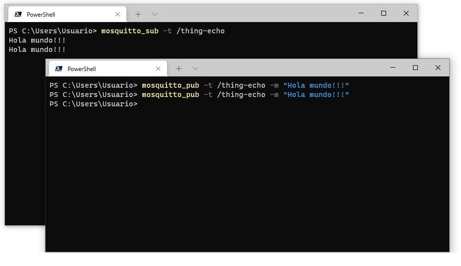
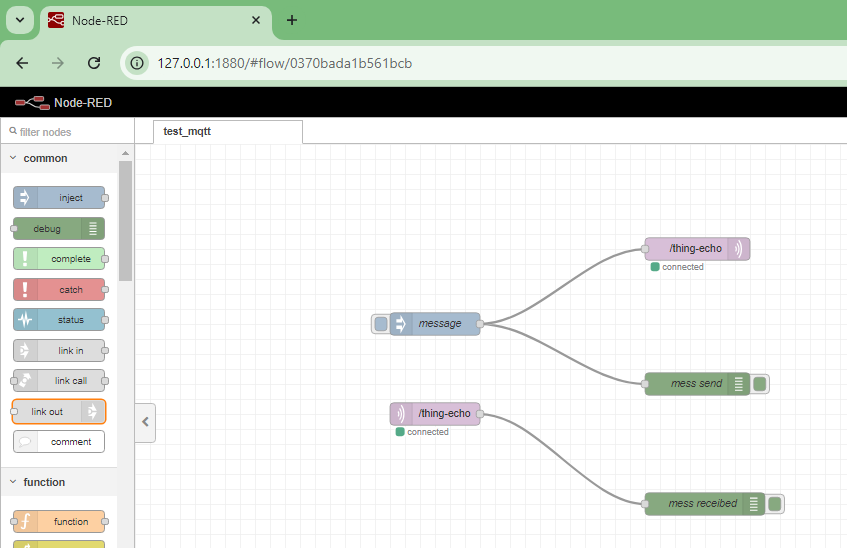
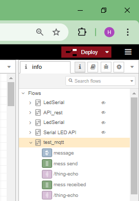
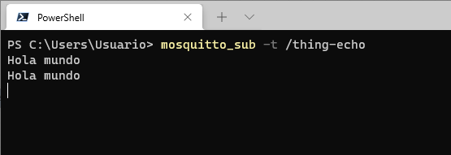
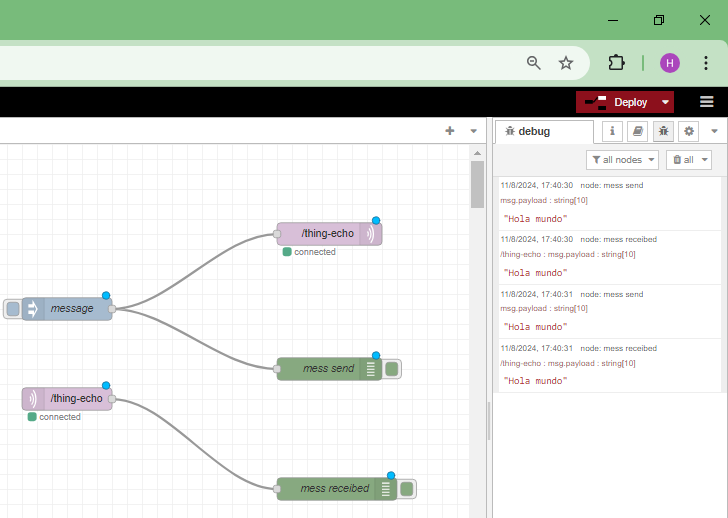

# Ensayo 1


## Test 1 - Inicial en mosquitto


```
mosquitto
```

```
mosquito_sub -t /thing-echo
```

```
mosquito_pub -t /thing-echo -m "Hola mundo!!!"
```

Ok

Los resultados se muestran a continuación:



## Test 2 - Conectar MQTT con Node-Red

Elementos

1. Inject
2. MQTT...
3. MQTT...
4. Debug...

* **Flujo**:
  
  

* **Resumen flujo**:
  
  

* **Debug flujo**: 
  
  Se enviaron dos mensajes de Hola mundo.

  Los resultados se muestran a continuación:

  

  

OK

## Test 3 - Aplicación que envia comandos para prender y apagar el bombillo en una oficina.


A continuación se describe el topic tree de la aplicación:

```
├── device
│   ├── 1
│   │   ├── lights
│   │   │   ├── control
│   │   │   └── state
│   ├── 2
│   │   ├── lights
│   │   │   ├── control
│   │   │   └── state
```

La siguiente tabla muestra los escenarios de la aplicación:

| **Escenario**                  | **Topico**                            | **JSON Message**                      |
|--------------------------------|---------------------------------------|---------------------------------------|
| Encender la lampara 1          | `house/device/id-dev1/lights/control` | `{ "command": "ON" }`                 |
| Apagar la lampara 1            | `house/device/id-dev1/lights/control` | `{ "command": "OFF" }`                |
| Estado de la lampara 1 (ON)    | `house/device/id-dev1/lights/state`   | `{ "state": "ON" }`                   |
| Estado de la lampara 1 (OFF)   | `house/device/id-dev1/lights/state`   | `{ "state": "OFF" }`                  |
| Encender la lampara 2          | `house/device/id-dev2/lights/control` | `{ "command": "ON" }`                 |
| Apagar la lampara 2            | `house/device/id-dev2/lights/control` | `{ "command": "OFF" }`                |
| Estado de la lampara 2 (ON)    | `house/device/id-dev2/lights/state`   | `{ "state": "ON" }`                   |
| Estado de la lampara 2 (OFF)   | `house/device/id-dev2/lights/state`   | `{ "state": "OFF" }`                  |
| Encender todas las luces (ON)  | `house/device/#/lights/state`         | `{ "command": "ON" }`                 |
| Apagar todas las luces (OFF)   | `house/device/#/lights/state`         | `{ "command": "OFF" }`                |
| Estado de todas las luces (ON) | `house/device/#/lights/state`         | `{ "command": "ON" }`                 |
| Estado de todas las luces (OFF)| `house/device/#/lights/state`         | `{ "command": "OFF" }`                |

### Montaje y prueba de los flujos en Node-RED

